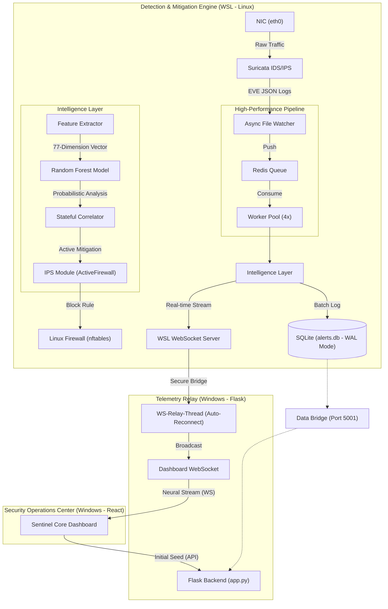

# Sentinel Core: System Architecture & Data Flow

This document provides a comprehensive overview of the **Sentinel Core Hybrid Intrusion Prevention System (IPS)**, detailing the multi-layer components, their interconnections, and the lifecycle of a network event from raw capture to active mitigation and visualization.

## 🗺️ High-Level Architecture

The system follows a **split-host architecture**, leveraging Linux's superior packet processing and firewall capabilities (WSL) and Windows' robust dashboard visualization (Flask/React).

---

## 💻 Tech Stack

| Layer | Technologies |
| :--- | :--- |
| **Security Engine** | Suricata (IDS/IPS), `nftables`/`iptables` (Mitigation) |
| **Pipeline Acceleration** | Redis (Event Queueing), `AsyncFileWatcher` (Low-latency ingestion) |
| **Machine Learning** | Scikit-Learn (Random Forest), Pandas, NumPy |
| **Backend Integration** | Python 3.12, Flask, Flask-Sock |
| **Frontend UI** | React 19, Vite, Lucide React (Sentinel Core Design System) |
| **Communication** | Native WebSockets (`asyncio`/`websockets`) for <10ms relay latency |
| **Data Persistence** | SQLite3 (WAL Mode, High-performance batch logging) |
| **Analysis AI** | Google Gemini (Automated Security Simulation Analysis) |

---

## 🔄 Detailed Data Flow

### 1. The Sensor Phase (WSL)
1.  **Suricata** monitors the virtual network interface and generates high-fidelity logs in the `eve.json` format.    
2.  The **Async File Watcher** detects new log lines within 10ms, supporting rotation and truncation.

### 2. The Acceleration Phase (Redis)
1.  Events are pushed to a **Redis Queue** to decouple ingestion from processing.
2.  A **Worker Pool** of 4 parallel threads consumes events in batches, maximizing multi-core performance.

### 3. The Intelligence Phase (ML & Correlation)
1.  **Feature Extraction**: The system extracts **77 behavioral features** (CICIDS standard).
2.  **Inference**: A **Scikit-learn Random Forest** model classifies the traffic with >95% accuracy.
3.  **Stateful Correlation**: Connection history is tracked per IP to detect **Volumetric (DoS)** and **Reconnaissance (Port Scan)** patterns.

### 4. The Mitigation Phase (IPS)
1.  **Evaluation**: If a threat reaches **>95% confidence** (via ML or Stateful rules), the IPS module is triggered.  
2.  **Blocking**: The `ActiveFirewall` module issues a dynamic `nftables` block rule to the Linux host.

### 5. The Telemetry Phase (Windows Bridge)
1.  The **Flask Relay** maintains a persistent **Relay Thread** with exponential backoff and automatic IP resolution for WSL.
2.  New alerts and mitigation statuses are instantly broadcasted to the dashboard.

### 6. The UI Phase (React)
1.  **Seed & Stream Architecture**: On load, the dashboard performs an **Initial Seed** of historical data (via the WSL Data Bridge), then pivots to the **Neural Stream (WebSocket)** for instantaneous updates.
2.  **Visualization**: Dynamic charts and the "Live Event Stream" provide sub-second visibility into the network perimeter.

---

## 📁 Module Organization

The project structure has been streamlined for maintainability:

| Location | Role | Status |
| :--- | :--- | :--- |
| `src/ml_engine/` | Core ML Inference, Redis Pipeline & IPS | Active |
| `src/dashboard/` | Flask Relay & Simulation API | Active |
| `src/common/` | Shared utilities (DB, Features, Config) | Active |
| `tests/` | Consolidated validation suite | Active |
| `data/logs/` | Centralized telemetry & heartbeats | Active |

---

## 🌐 Network Configuration

- **8765 / 8999**: Internal WSL Sensor WebSocket (Telemetry Out).
- **5001**: WSL Data Service (Database & Stats Bridge).
- **5000**: Windows Backend (Flask API & WebSocket Relay).
- **3000**: React UI Development Server.
- **6379**: Redis Server (WSL-Internal).

---

## 🧠 Analysis Strategy
The **Sentinel Core** uses a **Tri-Layer Behavioral Analysis**:
- **Layer 1 (Signature)**: Suricata catches known exploit patterns.
- **Layer 2 (Probabilistic)**: ML Engine identifies atypical packet behaviors.
- **Layer 3 (Stateful)**: Flow correlator identifies multi-packet attack lifecycles (DoS/Scans).
