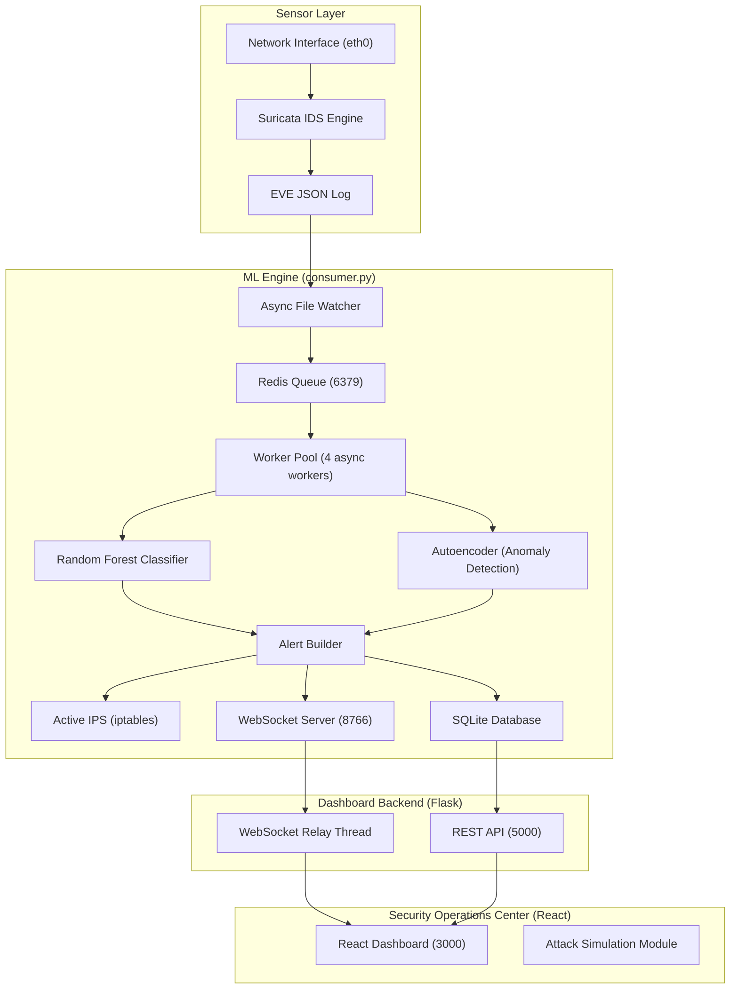

# Sentinel Core — System Architecture

## Overview

Sentinel Core is a **unified, single-host** Intrusion Detection and Prevention System (IDS/IPS) running entirely on **native Linux (Ubuntu)**. It combines Suricata's packet inspection engine with a multi-layer machine learning pipeline (Random Forest + Autoencoder) for real-time traffic classification and automated threat response.

## Data Flow

### 1. Sensor Phase
1.  **Suricata** captures packets from the network interface and writes structured events to `/var/log/suricata/eve.json`.
2.  The **Async File Watcher** detects new log lines with sub-second latency, handling log rotation and truncation.

### 2. Ingestion Phase
1.  New events are pushed into a **Redis queue** (`sentinel_alerts_queue`) for decoupled, buffered processing.
2.  A legacy **direct file-tailing mode** is available as a fallback when Redis is unavailable.

### 3. Processing Phase
1.  A pool of **4 async workers** dequeue events from Redis in batches.
2.  **Feature Extraction** converts raw EVE JSON into a CICIDS-compatible 78-dimension feature vector.
3.  **Tri-Layer ML Inference**:
    -   **Layer 1 (Random Forest)**: Fast binary classification (attack/normal).
    -   **Layer 2 (Autoencoder)**: Reconstruction-error-based anomaly detection for zero-day threats.
    -   **Layer 3 (Suricata Rules)**: Signature-based override for known attack patterns.

### 4. Response Phase
1.  Classified alerts are written to **SQLite** via batched inserts (with fallback recovery).
2.  High-confidence threats (≥95%) trigger the **Active IPS** which issues `iptables -I INPUT -s <IP> -j DROP` rules.
3.  Alerts are broadcast via **WebSocket** (port 8766) to all connected relay clients.

### 5. Telemetry Phase
1.  The **Flask Relay** maintains a persistent WebSocket connection to the consumer with exponential backoff.
2.  Browser clients connect via `ws://localhost:5000/ws/alerts` and receive real-time alert streams.
3.  The React dashboard performs an **initial seed** from the REST API, then switches to the live WebSocket stream.

### 6. Stateful Correlation
-   **Port Scan Detection**: Tracks unique destination ports per source IP over a 10s sliding window. Triggers at >25 unique ports.
-   **DoS Detection**: Tracks flow volume per source IP. Triggers at >100 flows within the window.

## Port Map

| Port | Service | Protocol |
|------|---------|----------|
| 8766 | Consumer WebSocket | WS |
| 5000 | Flask API & WS Relay | HTTP/WS |
| 3000 | React Dashboard | HTTP |
| 6379 | Redis | TCP |

## Key Files

| File | Purpose |
|------|---------|
| `src/ml_engine/consumer.py` | Main ML engine — WebSocket server, model inference, log tailing |
| `src/ml_engine/worker_pool.py` | Async worker pool for Redis-backed event processing |
| `src/ml_engine/file_watcher.py` | Async file watcher for EVE log with rotation detection |
| `src/ml_engine/firewall.py` | Active IPS — iptables-based IP blocking |
| `src/common/config.py` | Centralized configuration (ports, paths, thresholds) |
| `src/common/database.py` | Thread-safe SQLite handler with batching |
| `src/common/net_utils.py` | Local IP and gateway resolution with caching |
| `src/common/feature_extractor.py` | CICIDS feature vector extraction from EVE JSON |
| `src/common/alert_builder.py` | Shared alert payload construction |
| `src/dashboard/app.py` | Flask backend — REST API and WebSocket relay |
| `src/dashboard/integration.py` | Database query interface for dashboard seeding |
| `ui/src/App.jsx` | React dashboard — real-time monitoring and attack lab |
