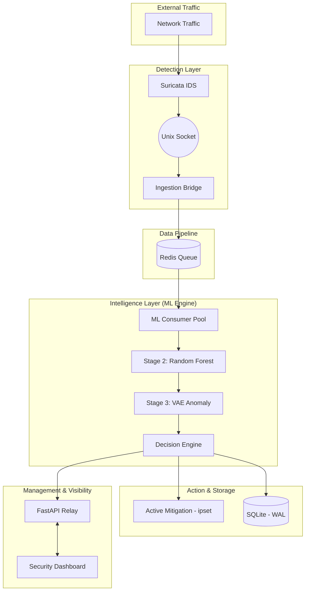

# Sentinel Core V4: System Architecture

## 🖼️ Visual Overview

| System Architecture | Service Connection Map |
| :---: | :---: |
|  |  |

This document provides a technical deep-dive into the architecture of **Sentinel Core V4**, a hybrid Machine Learning (ML) Intrusion Prevention System.

---

## 1. High-Level System Overview

Sentinel Core follows a decoupled, asynchronous architecture designed for high-throughput network monitoring and real-time behavioral analysis.

---

## 2. Core Components

### 2.1 Detection Layer (Sensor)
*   **Suricata**: The primary signature-based detection engine. It is configured to output EVE JSON alerts to a local Unix socket rather than the filesystem to minimize I/O latency.
*   **Ingestion Bridge**: A high-performance Python service that reads from the Unix socket, performs initial normalization, and pushes events into the Redis pipeline.

### 2.2 Data Pipeline
*   **Redis**: Acts as the system's central nervous system. It provides a non-blocking message queue (`sentinel_alerts_queue`) and a telemetry stream (`sentinel_alerts_stream`). This enables the system to handle bursts of 1000+ events per second without dropping packets.

### 2.3 ML Engine (V4 Intelligence)
The ML Engine utilizes a **Tri-Layer Defense** strategy:
1.  **Stage 1: Signatures**: Handled by Suricata for known patterns.
2.  **Stage 2: Supervised Learning (Random Forest)**: Classified against 49 flow-based features. Optimized via ONNX for sub-ms inference.
3.  **Stage 3: Unsupervised Learning (VAE)**: A Variational Autoencoder handles zero-day detection by analyzing reconstruction loss for suspicious or unknown traffic patterns.

### 2.4 Active Mitigation Module
When the **Decision Engine** identifies a high-confidence threat (Confidence > 95%), it triggers the mitigation module:
*   **ipset**: Malicious IPs are added to a kernel-level blocklist (`sentinel_blocks`).
*   **iptables/nftables**: Pre-configured chains drop traffic matching the blocklist at the kernel level, preventing it from reaching application layers.

---

## 3. Data Flow & Feature Extraction

### 3.1 49-Feature Schema
Sentinel Core V4 maps incoming Suricata telemetry to the **UNSW-NB15** feature schema. This includes:
*   **Basic Features**: Duration, protocol, state.
*   **Content Features**: Payload size, TTL, window size.
*   **Stateful Temporal Features**: `ct_srv_src`, `ct_dst_src_ltm`, etc., calculated using an in-memory **StatefulFeatureTracker**.

### 3.2 State Tracking
The `StatefulFeatureTracker` maintains a sliding window of recent connections to calculate volumetric statistics (e.g., "number of connections to the same service from the same source in the last 100 events").

---

## 4. Networking & Infrastructure

### 4.1 Unified API/UI
Both the **FastAPI Relay** and the **React Dashboard** are served from a single unified server instance on **Port 3000**.
*   **API Routes**: `/api/alerts`, `/api/pipeline/status`.
*   **WebSocket**: Native WebSocket connection for real-time alert streaming.

### 4.2 Security & Isolation (SDN)
While optimized for native Linux, Sentinel Core retains optional **SDN-Enhanced** capabilities:
*   **OVS Integration**: Ability to steer traffic to namespaces.
*   **Honeypot Redirection**: Suspicious traffic can be transparently routed to a Dionaea sink in a dedicated network namespace (`honeypot`).

---

## 5. Persistence & Observability

### 5.1 SQLite (WAL Mode)
All alerts are persisted in an optimized SQLite database. The use of **Write-Ahead Logging (WAL)** ensures that the dashboard can read alert history even during high-frequency writes from the ML Engine.

### 5.2 Diagnostics
The `./diag.sh` script provides a real-time status check of all architectural components, including:
*   Process health (PIDs)
*   Port availability
*   Redis queue depth/lag
*   Firewall chain status
*   Heartbeat freshness
