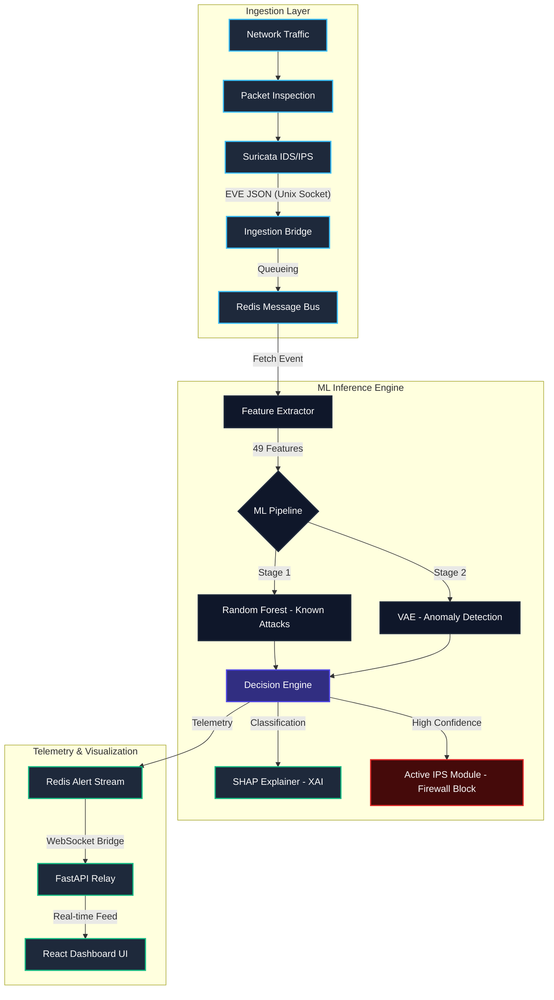

# Sentinel Core: Project Architecture

This document provides a detailed visual and technical breakdown of the Sentinel Core V4 data pipeline and ML inference architecture.

## 🏗️ System Data Flow

The following diagram illustrates the end-to-end journey of a network packet from ingestion to visualization and active mitigation.

## 🛠️ Component Breakdown

### 1. Ingestion Layer
*   **Suricata IDS**: Operates in IPS mode, performing deep packet inspection against 30,000+ signatures.
*   **Ingestion Bridge**: A custom Rust/Python high-performance bridge that normalizes Suricata's EVE JSON and pushes to Redis Streams.

### 2. ML Inference Engine
*   **Feature Extractor**: Performs stateful flow tracking to generate 49 complex features (e.g., `ct_srv_src`, `sload`, `dload`).
*   **ML Pipeline**:
    *   **Random Forest (ONNX)**: Trained on the UNSW-NB15 dataset for high-accuracy classification of known attack vectors (DDoS, Recon, Exploits).
    *   **VAE (Variational Autoencoder)**: A PyTorch-based anomaly detector that identifies "Zero-Day" threats by measuring reconstruction error (MSE).
*   **Decision Engine**: Corroborates ML scores, signature hits, and CTI reputation to make the final verdict.
*   **SHAP Explainer**: Provides local interpretability for every ML decision, highlighting which features (e.g., source load, packet count) triggered the alert.

### 3. Active Mitigation (IPS)
*   **Firewall Module**: Interfaces with `ipset` and `iptables` to drop traffic from malicious IPs at the kernel level.
*   **SDN Connector**: (Optional) Interfaces with Ryu/OpenFlow controllers to steer malicious traffic to honeypots.

### 4. Telemetry & UI
*   **FastAPI Relay**: Serves as the central hub, providing a REST API for forensics and a high-speed WebSocket stream for the dashboard.
*   **React Dashboard**: A modern, Framer-Motion-powered UI for real-time SOC operations.

---

## 📈 Pipeline Performance Metrics

| Metric | Performance |
| :--- | :--- |
| **Ingestion Latency** | < 5ms (Suricata to Redis) |
| **Inference Latency** | < 15ms (RF + VAE + SHAP) |
| **Throughput** | ~2,500 PPS per worker |
| **Database Sync** | Async Batch (50 events/flush) |

---
