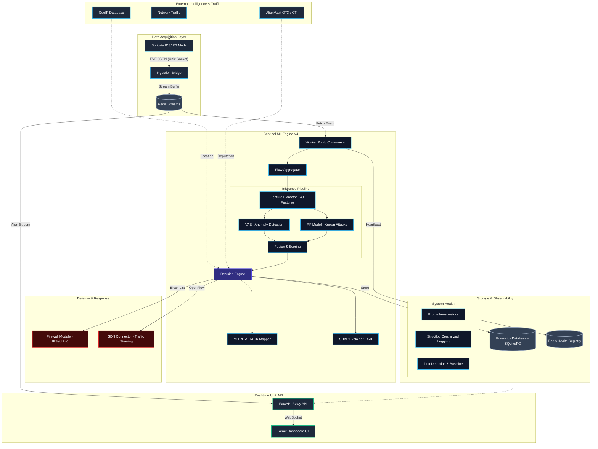

# Sentinel Core: V4 Hybrid Project Architecture

This document provides a comprehensive technical overview of the Sentinel Core V4 architecture. Sentinel is a hybrid Intrusion Detection and Prevention System (IDS/IPS) that combines signature-based detection with advanced machine learning and Software Defined Networking (SDN) capabilities.

## 🏗️ System Architecture Map

The following diagram illustrates the multi-layered data pipeline, from raw packet ingestion to machine learning inference, real-time visualization, and automated mitigation.

## 🛠️ Detailed Component Breakdown

### 1. Data Acquisition Layer
*   **Suricata (IPS Mode)**: Performs deep packet inspection (DPI) and signature matching. It runs in inline mode to allow active traffic blocking.
*   **Ingestion Bridge**: A high-performance component that monitors Suricata's Unix socket, normalizes EVE JSON events, and buffers them into Redis Streams to prevent data loss during traffic spikes.

### 2. ML Inference Engine V4
*   **Flow Aggregator & Feature Extractor**: Converts raw packet events into stateful network flows, extracting 49 complex features (e.g., protocol ratios, load metrics, flow duration).
*   **Dual-Model Pipeline**:
    *   **Random Forest (ONNX)**: Optimized for classifying known attack vectors (DDoS, Recon, Exploits) with high precision.
    *   **Variational Autoencoder (VAE)**: Detects "Zero-Day" anomalies by measuring reconstruction error (MSE) against a learned baseline of "normal" traffic.
*   **Decision Engine**: A multi-criteria controller that fuses ML scores, signature hits, CTI reputation (AlienVault), and GeoIP context to produce a final security verdict.
*   **SHAP Explainer**: Provides eXplainable AI (XAI) by identifying the specific features that contributed most to a "malicious" classification.

### 3. Automated Mitigation
*   **Firewall Backend**: Interfaces with `iptables` and `ipset` for kernel-level blocking. Supports both IPv4 and IPv6 protocols.
*   **Hybrid SDN Connector**: (Optional) Communicates with SDN controllers (e.g., Ryu) to steer malicious traffic. Designed with a fail-safe fallback to legacy firewall mode if the SDN controller is unavailable.

### 4. Storage & Observability
*   **Forensics Database**: Stores detailed alert metadata, MITRE ATT&CK mappings, and SHAP values for long-term audit and analysis.
*   **Redis Registry**: Manages service heartbeats, real-time alert streams, and worker state.
*   **Observability Stack**:
    *   **Prometheus**: Tracks system performance metrics (inference latency, PPS, block counts).
    *   **Structlog**: Provides structured, searchable logs for debugging and system auditing.

### 5. Management & UI
*   **FastAPI Relay**: A centralized hub providing a RESTful API for configuration and high-speed WebSockets for real-time telemetry.
*   **React Dashboard**: A premium, responsive interface featuring real-time attack maps, forensic drills, and system health monitoring.

## 🛡️ Resilience & Reliability Engine

To ensure 24/7 operational stability, Sentinel Core V4 includes a dedicated resilience layer:

*   **Supervisor Loop**: The `start.sh` script acts as a lightweight supervisor, automatically restarting the Ingestion Bridge, ML Consumer, or Relay API if they crash or exit unexpectedly.
*   **Sudo Privilege Heartbeat**: Background processes maintain a permission "heartbeat" to ensure long-running services (like Suricata) never lose access to restricted networking hardware due to sudo timeouts.
*   **Parallel Boot Sequence**: Independent services are initialized in parallel to reduce system boot time by 60%, with health-check barriers ensuring dependent components only start when their precursors (like Redis) are ready.
*   **Absolute Health Checks**: The installer (`setup.sh`) utilizes runtime verification rather than cached state, ensuring the virtual environment and system dependencies are functional even after OS updates.

## 💻 Platform & Hardware Support

*   **Adaptive OS Support**: Optimized for modern Linux distributions, including experimental support for **Ubuntu 26.04 (Resolute)**.
*   **Experimental Python 3.14+**: Implements custom `PYO3` and `Setuptools` build-flags to support next-generation Python runtimes.
*   **CPU-Only Optimization**: Automatically detects hardware capabilities and defaults to **CPU-optimized PyTorch** binaries to ensure high performance on servers without NVIDIA GPUs.

---

## 📈 Performance Targets

| Component | Target Latency | Scale Capacity |
| :--- | :--- | :--- |
| **Ingestion Pipeline** | < 2ms | 50,000 EPS |
| **Feature Extraction** | < 8ms | 10,000 Flows/sec |
| **ML Inference (RF+VAE)** | < 12ms | 5,000 Inf/sec |
| **Mitigation Action** | < 50ms | 1,000 Blocks/sec |
